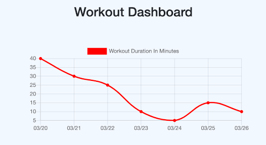

# Workout Tracker

## Description

An application to track your workouts. You can log multiple exercises in a single workout, and track the name, type, weight, sets, reps, and duration of exercise. If you are doing cardio, you can track distance traveled.

The following image shows a glimpse of the application:

## Getting Started

This is a simple application that runs right in the browser, no installation or downloads needed. This application is not currently deployed.

## Built With:

JavaScript - programming language  
Node.js - JavaScript runtime  
Express - Node.js web application framework  
MongoDB - database 
Mongoose - database schema

## Author:

Brittany Fortner  
See commit history [here](https://github.com/bfeliz/workout-tracker/graphs/contributors).

## Planned Updates

There are no plans to further update this application at this time.
